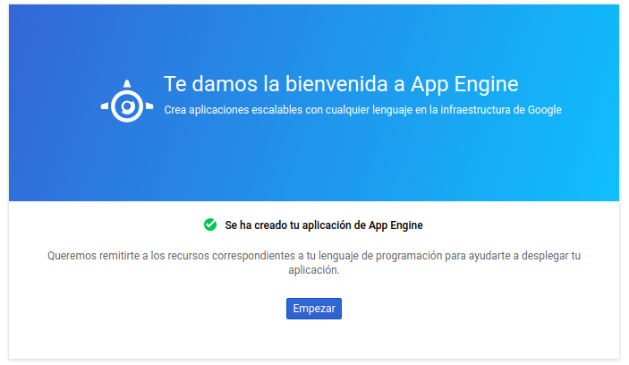
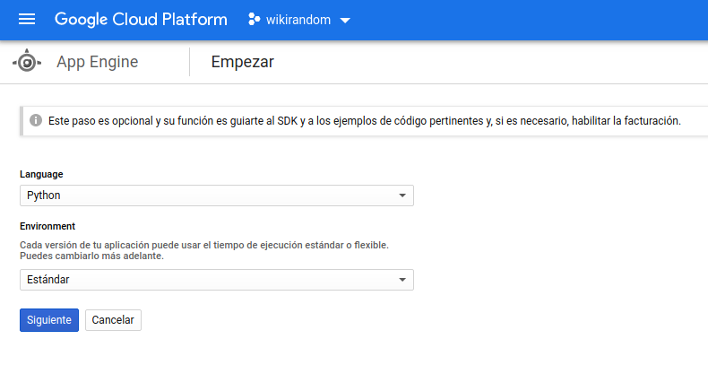
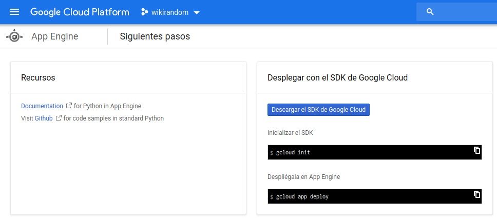
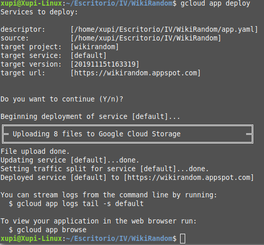

# Despliegue en App Engine (Google Cloud)

A continuación voy a detallar los pasos para que se haya podido desplegar el servicio en un PaaS (Platform as a Service) para que sea más accesible. En este caso hemos escogido App Engine de Google Cloud por su eficacia, su fiabilidad y el hecho de que no cobra más de lo que tú estableces, así que es posible tener un plan gratuito sin preocuparse.

Primero tendremos que crearnos una cuenta en [Google Cloud](https://cloud.google.com/). No hará falta crear un proyecto como tal, porque más tarde se puede crear uno automáticamente mediante línea de órdenes.

Siguiendo esta [guía](https://console.cloud.google.com/appengine/start) proporcionada por Google, y en base a este [proyecto de ejemplo](https://github.com/GoogleCloudPlatform/python-docs-samples/blob/master/appengine/standard_python37/hello_world) hemos podido configurar el servicio. 

En el directorio de nuestra aplicación (ya configurado con _gunicorn_ y _flask_) tendremos que usar el SDK de Google Cloud. Este se puede instalar fácilmente con `sudo snap install google-cloud-sdk --classic`
Hemos creado un archivo llamado [app.yaml]() que en este caso va a usar gunicorn para desplegar nuestra aplicación y contendrá lo siguiente:
```
#app.yaml - para Google App Engine
runtime: python37
entrypoint: gunicorn --chdir my_app wsgi:app
```
Ahora podremos seguir [estos pasos](https://console.cloud.google.com/appengine/start) seleccionando nuestro proyecto.




Con todo esto ya hemos podido hacer `gcloud init` para iniciar sesión en Google Cloud, y, posteriormente, `gcloud app deploy` para que se lance el proyecto.

Se creará un archivo _.gcloudignore_ que equivaldrá a [_.gitignore_](https://github.com/OMGitsXupi/WikiRandom/blob/master/.gitignore) (pondremos lo que no queremos que tenga en cuenta)