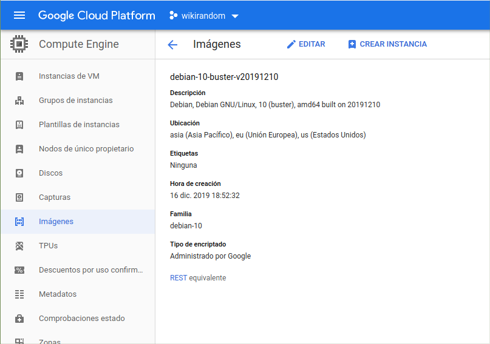
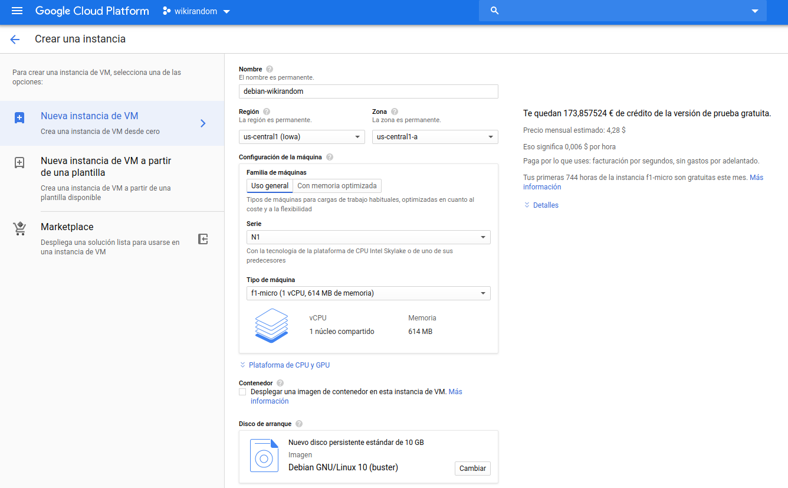

# Provisionar máquina virtual

La máquina virtual que he usado funciona con el servicio de Google Cloud, y voy a detallar los pasos a seguir para crear una instancia y provisionarla con _ansible_.

## Elegir SO
He intentado usar una máquina con _Ubuntu-minimal_ pero no funcionaba correctamente Python y me he decantado con la última versión de Debian (Debian-10), que pesa casi la mitad de Debian-9, y según he visto en varias comparativas, es más eficiente que Ubuntu.

## Crear instancia
En mi caso he creado una instancia a partir de las imágenes que ofrecen por defecto, que pesa 6,3GB.




Pulsando en _CREAR INSTANCIA_ vamos a la pantalla de configuración de la máquina, en la cual he puesto las opciones más baratas (en _Tipo de máquina_) para que pueda ser una máquina gratuita.



## Conectar por ssh con la máquina virtual

Para automatizar el provisionamiento con ansible es necesario tener acceso mediante ssh mediante intercambio de claves, pero esto con la herramienta de Google se ha realizado automáticamente con el comando `gcloud beta compute --project "wikirandom" ssh --zone "us-central1-a" "debian-10-wikirandom"` (al estar logueado en la herramienta de gcloud). Ahora con un comando normal de `ssh [IP externa]` puedo conectarme sin problema.


## Automatizar provisionamiento con __ansible__

Para automatizar la instalación de  usar esta herramienta necesitamos 3 archivos: [_ansible.cfg_](https://github.com/OMGitsXupi/WikiRandom/blob/master/ansible.cfg), [_ansible_hosts_](https://github.com/OMGitsXupi/WikiRandom/blob/master/ansible_hosts)y [_playbook.yml_](https://github.com/OMGitsXupi/WikiRandom/blob/master/playbook.yml)

Los dos primeros archivos son muy simples, _ansible.cfg_ está completamente por defecto, (sacado de los apuntes de la asignatura)

```
[defaults]
host_key_checking = False
inventory = ./ansible_hosts
```

Por otro lado _ansible_hosts_ tiene solo una función: indicar la dirección ip de la máquina virtual (a la que nos conectamos por _shh_). En mi caso hay un problema y es que, al reiniciar la máquina, Google le asigna otra ip diferente, entonces este archivo habría que modificarlo, pero es tan sencillo como sustituirla.

```
[wikirandom]
34.67.45.169
```

La receta o _playbook_ está formada por reglas:
```
- name: wikirandom
  hosts: all # Se ejecutará para todas las direcciones de ansible_hosts
  become: true # Para tener permisos de root en todas las tareas
  tasks: # Tareas (pasos a seguir que se ejecutarán por orden)

    - name: instalar pip
      apt: name=python3-pip state=present update_cache=yes

    - name: instalar supervisord
      command: pip3 install supervisor

    - name: instalar git
      apt: name=git state=present

    - name: repositorio
      git:
        repo: https://github.com/OMGitsXupi/WikiRandom.git
        dest: wikirandom/

   # A continuación vienen las instalaciones que están en requeriments.txt
    - name: instalar fabric
      command: pip3 install fabric3

    - name: instalar pytest
      command: pip3 install pytest

    - name: instalar flask
      command: pip3 install Flask

    - name: instalar gunicorn
      command: pip3 install gunicorn
```
Aclaraciones de _playbook.yml_:
- _apt_ ejecutará un comando de apt para instalar lo que le digamos a continuación.
- _repositorio_ clonará nuestro repositorio en un directorio llamado _wikirandom_
Todo esto se podrá ejecutar con `ansible-playbook playbook.yml` aunque yo he modificado [el Fabfile](https://github.com/OMGitsXupi/WikiRandom/blob/master/fabfile.py) para que lo ejecute al hacer `fab provisionar`.

## Crear imagen personalizada


