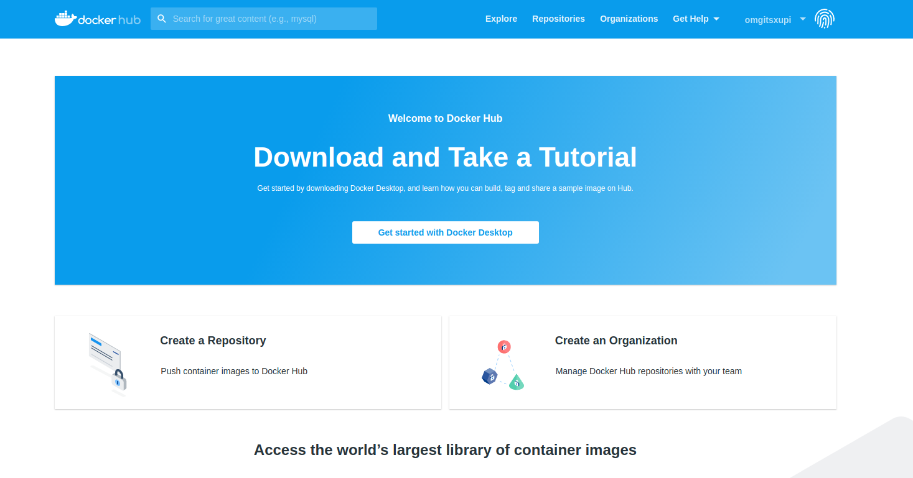
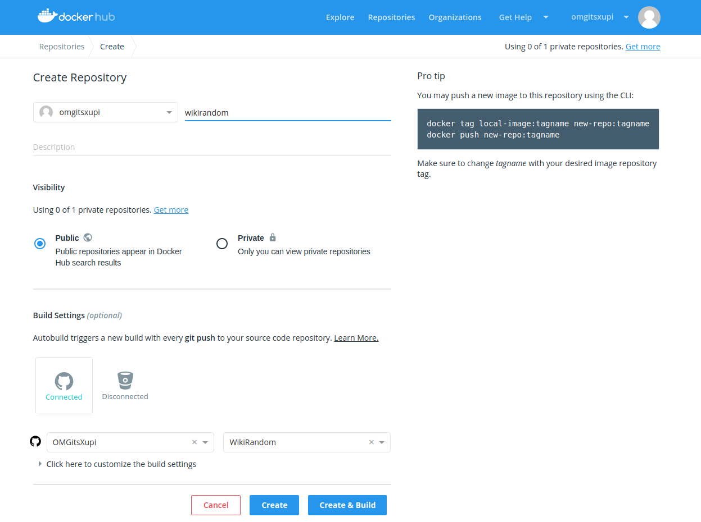
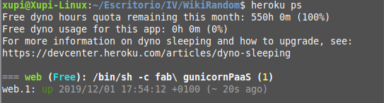

# Despliegue usando contenedores

A continuación voy a explicar los siguientes apartados:
- Crear contenedor y usar localmente.
- Configuración en DockerHub.
- Configurar despliegue en la nube con Heroku.
- Configurar despliegue en la nube con Google App Engine.
## Crear contenedor y usar localmente
Para que se cree el contenedor es necesario un archivo llamado [Dockerfile](https://github.com/OMGitsXupi/WikiRandom/blob/master/Dockerfile), que en mi caso contendrá lo siguiente:

```
FROM python:3.7-slim-buster   # Imagen que se cargará
WORKDIR /usr/src/wikirandom   # Directorio dentro del contenedor donde se trabajará

COPY requirements.txt requirements.txt   # Copiamos los requerimientos a nuestro contenedor
RUN pip install -r requirements.txt   # Instalamos lo necesario para nuestro proyecto
COPY . /usr/src/wikirandom   # Copiamos todo lo demás

CMD fab gunicornPaaS   # Órden para arrancar el microservicio (usando la herramienta de construcción)
```
Apuntes sobre el Dockerfile:
- Se usa la imagen _slim-buster_ porque es más ligera que las imágenes por defecto, aunque no tanto como _alpine_, pero según me he informado, _alpine_ por sí sola no es del todo capaz de realizar algunas tareas con Python, así que he optado por esta para que funcione completamente sin tener que modificar nada.
- Para desplegar (en CMD) se usa la misma órden que en los PaaS porque únicamente ejecuta una línea de _gunicorn_, siendo igual a lo que se usa en este contenedor.

Para poder desplegar el contenedor en mi máquina y ver si funciona realmente, me he ayudado de un archivo llamado  [_docker-compose.yml_](https://github.com/GoogleCloudPlatform/appengine-custom-runtimes-samples/blob/master/nginx/docker-compose.yml) que contiene lo siguiente:
```
# docker-compose.yml
version: '2'

services:
   wikirandom:
      build:
        context: .
        dockerfile: Dockerfile
      volumes:
        - .:/usr/src/wikirandom
      working_dir: /usr/src/wikirandom
```
He usado esta herramienta porque en otra asignatura la estamos usando y es perfectamente efectiva y bastante sencilla. Con los dos archivos bien configurados lo que hay que hacer para desplegar el contenedor es `docker-compose build` (no necesario si ya se ha hecho una vez y no se ha modificado _docker-compose.yml_) y `docker-compose run wikirandom`, y se puede ver cómo se inicia el microservicio.

## Configurar en DockerHub
Voy a explicar los pasos que he seguido para crear un repositorio en DockerHub y poder subir nuestra imagen:
Primero hay que crearse una cuenta, lógicamente, y después aparece la pantalla que vemos en la siguiente imagen, donde hay que darle a _Create a Repository_.



En el siguiente paso de la creación lo he conectado con mi repositorio de GitHub como se ve en la imagen, para que cuando se haga un push a _git_ se actualice automáticamente.



Ahora podremos bajarnos la imagen simplemente con `docker pull omgitsxupi/wikirandom`

## Configurar despliegue en la nube con Heroku

En el repositorio he creado otra app de Heroku llamada _xupi-docker_ con `heroku create xupi-docker`  y a continuación para subir nuestra aplicación a Heroku he usado `git push heroku master`. La primera vez vemos que tarda bastante, y al finalizar podemos comprobar si se ha desplegado correctamente con `heroku ps`, obteniendo algo así:



En la web de Heroku he configurado (como se indicaba en [esta explicación](heroku.md)) que no sea necesario hacer esto, y que con cada _push_ a nuestro repositorio, se actualice automáticamente.

En el _dashboard_ de _Heroku_ podremos crear un _pipeline_, que tendremos que sincronizar con un repositorio de GitHub para que la aplicación se actualice con cada push a nuestro repositorio en vez de tener que usar `git push heroku master` continuamente.

## Configurar despliegue en la nube con Google App Engine

En este caso he modificado la aplicación original para que ahora use _docker_ cambiando el archivo [app.yaml](https://github.com/OMGitsXupi/WikiRandom/blob/master/app.yaml) a lo siguiente, basándome en [este ejemplo](https://github.com/GoogleCloudPlatform/appengine-custom-runtimes-samples/blob/master/nginx/app.yaml).
```
#app.yaml - para Google App Engine
runtime: custom
env: flexible
```
Tras esto es tan sencillo como recargar la app con `gcloud app deploy`.
